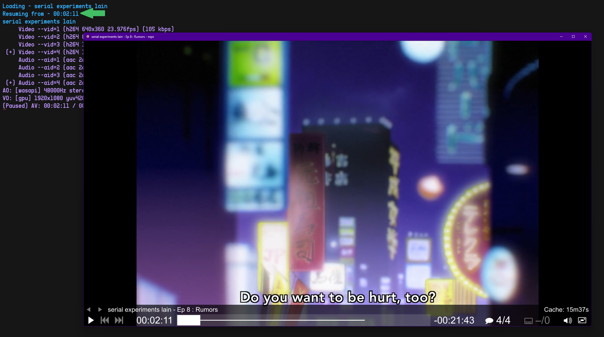
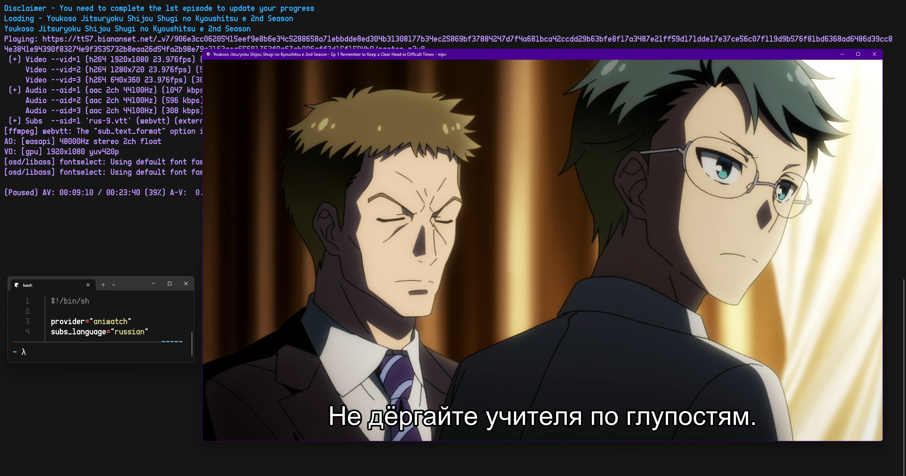
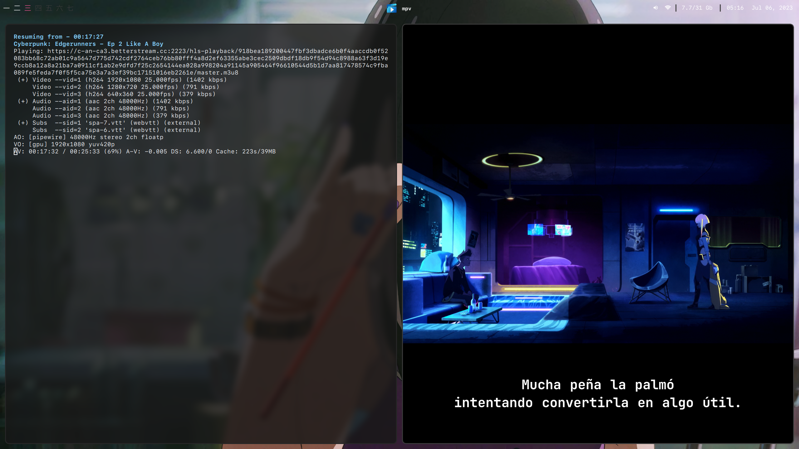
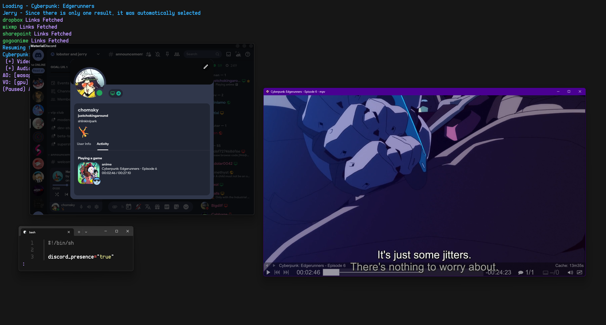
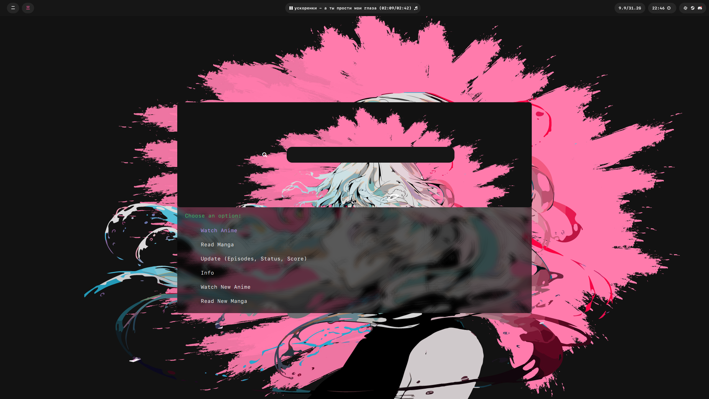
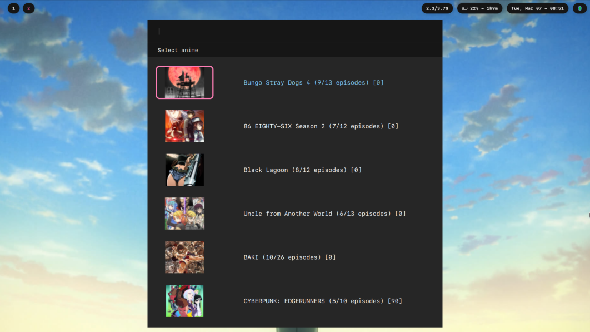

# Showcase

https://github.com/justchokingaround/jerry/assets/44473782/c73b0dd9-9637-439f-a5fb-aa8012b0a496


# Jerry
The core idea of the script is that it allows users to watch anime in sync with their anilist account, automatically updating and tracking all progress (down to seconds of an episode watched).

But the script also has a lot of other features, which you can find in the features section.

## Join the discord server!

### https://discord.gg/JTDS2CKjQU

---
## Table of Contents
- [Features](#features-please-check-the-wiki-for-configuration-information)
- [Installation](#installation)
- [Usage](#usage)
- [Configuration](#configuration)
- [Dependencies](#dependencies)
- [Credits](#credits)

## Features (please check the wiki for configuration information)
- Multiple providers: allanime (default), aniwatch, yugen, hdrezka and crunchyroll (requires token or email and password)
- Sync watch progress on Anilist on episode completion, and locally (down to the second watched, just like YouTube and Netflix does it)


- Customize subtitle language, video quality, provider and many other things (using arguments or config file)



- Discord Rich Presence: display currently watched anime in Discord (currently requires the installation of the helper python script: `jerrydiscordpresence.py`)


- External menu support: ability to use rofi, so that opening a terminal window isn't even required to run the script! (this can be used to setting the script to run on a keybind)



- Output episode links in JSON format


## Installation
### Linux/macOS
```sh
sudo curl -sL github.com/justchokingaround/jerry/raw/main/jerry.sh -o /usr/local/bin/jerry &&
sudo chmod +x /usr/local/bin/jerry
```

<details>
<summary>Windows installation instructions</summary>

* This guide covers how to install and use jerry with the Windows Terminal (which comes pre-installed with Windows 11), you could also use a different terminal emulator, that supports fzf, like for example Wezterm
* Note that the Git Bash terminal does *not* have proper 
fzf support

Basically, what we are going to do is install the bash shell and use it to install the shell script. We will also install the mpv video player and fzf, which are required for the script to work.

1. Install scoop

Open a PowerShell terminal https://learn.microsoft.com/en-us/powershell/scripting/install/installing-powershell-on-windows?view=powershell-7.2#msi (version 5.1 or later) and run:

```ps
Set-ExecutionPolicy RemoteSigned -Scope CurrentUser
irm get.scoop.sh | iex
```

2. Install git,mpv and fzf

```ps
scoop bucket add extras
scoop install git mpv fzf
```
3. Install windows terminal (you don't need to have a microsoft account for that)
   https://learn.microsoft.com/en-us/windows/terminal/install

4. Install git bash (select the option to add it to the windows terminal during installation)
   https://git-scm.com/download/win

(The next steps are to be done in the windows terminal, in a bash shell)

5. Download the script file to the current directory
```sh
curl -O "https://raw.githubusercontent.com/justchokingaround/jerry/main/jerry.sh"
```

6. Give it executable permissions
```sh
chmod +x jerry.sh
```

7. Copy the script to path
```sh
cp jerry.sh /usr/bin/jerry
```

8. Use jerry
```sh
jerry --help
```

</details>


## Usage
```
Usage: jerry [options] [query]
If a query is provided, it will be used to search for an anime, and will default to the 'Watch New' option.

Options:
    -c, --continue
      Continue watching from currently watching list (using the user's anilist account)
    --dub
      Allows user to watch anime in dub
    -d, --discord
      Display currently watching anime in Discord Rich Presence (jerrydiscordpresence.py is required for this, check the wiki for instructions on how to install it)
    -e, --edit
      Edit config file using an editor defined with jerry_editor in the config (\$EDITOR by default)
      If a config file does not exist, creates one with a default configuration
    -h, --help
      Show this help message and exit
    -i, --image-preview
      Allows image preveiw in fzf and rofi (Note: for image preview using fzf, ueberzugpp must be installed)
    -j, --json
      Outputs the json containing video links, subtitle links, referrers etc. to stdout
    -l, --language
      Specify the subtitle language
    -n, --number
      Specify the episode number for an anime
    --rofi, --dmenu, --external-menu
      Use an external menu (instead of the default fzf) to select an anime (default one is rofi, but this can be specified in the config file)
    -q, --quality
      Specify the video quality
    -s, --syncplay
      Watch anime together with friends, using Syncplay (only tested using mpv)
    -u, --update
      Update the script
    -v, --version
      Show the script version
    -w, --website
      Choose which website to get video links from (default: allanime) (currently supported: allanime, aniwatch, yugen, hdrezka, and crunchyroll)

  Note: 
    All arguments can be specified in the config file as well.
    If an argument is specified in both the config file and the command line, the command line argument will be used.

  Some example usages:
   jerry -q 720 banana fish
   jerry --rofi -l russian cyberpunk edgerunners -i -n 2
   jerry -l spanish cyberpunk edgerunners --number 2 --json
```
## Configuration

You can use the following command to edit your jerry configuration (in case a configuration file does not exist, a default one will be created, containing all the default values) :
```sh
jerry -e
```

For more information on the configuration file, please check the wiki.

## Dependencies
- grep
- sed
- curl
- fzf
- mpv (Video Player)
- rofi (optional)
- ueberzugpp (image preview in fzf) (optional)
- jq (for displaying anime/manga info) (optional)

## Credits
- Anilist API: [https://anilist.co/api/](https://anilist.gitbook.io/anilist-apiv2-docs)https://anilist.gitbook.io/anilist-apiv2-docs
